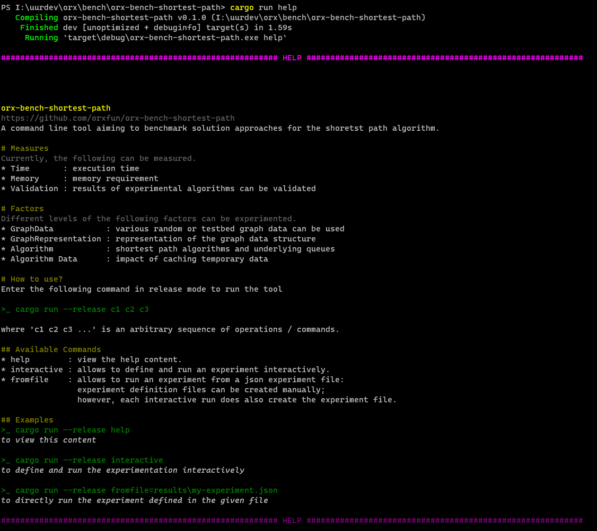
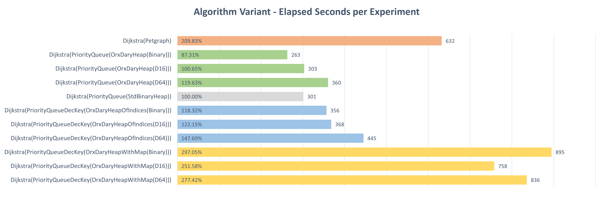
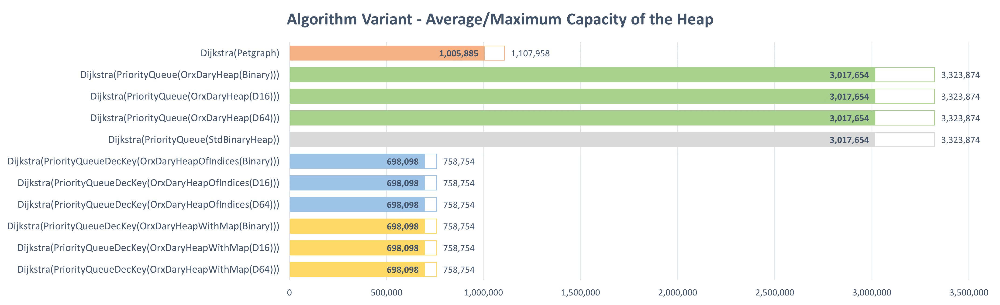
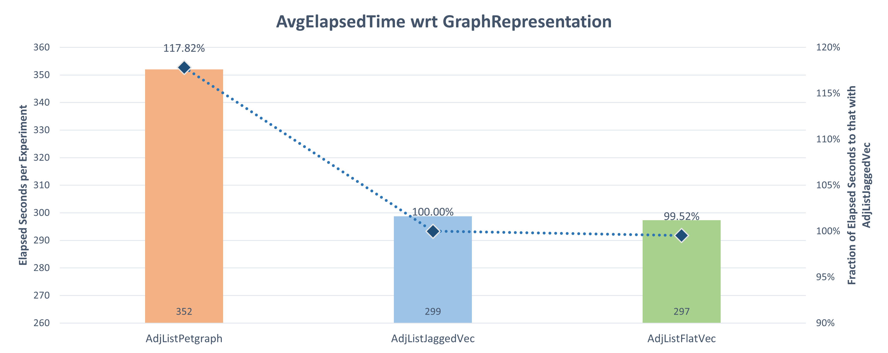

# orx-bench-shortest-path

A command line tool to enable benchmarking shortest path algorithms on different data sets with different graph representations, etc. It is possible to:

* create full factorial experiments using `interactive` mode,
* experiments can be executed directly from the interactive mode or from the created experiment file using `fromfile` mode.


## A. Usage

```bash
cargo run help
```



## B. Analysis

You may find the results of the most recent experiments [here](docs/results-20231031.xlsx) and the summary below.

### B.1. Algorithms

Currently, only Dijkstra's algorithm is experimented; however, with using different queues.

In the figure below, you may see the overall average of execution time with different variants.



In the next figure, required heap sizes are compared:




### B.2. Graph Representation

In the figure below, you may see the overall average of execution time with different underlying graph structures.



